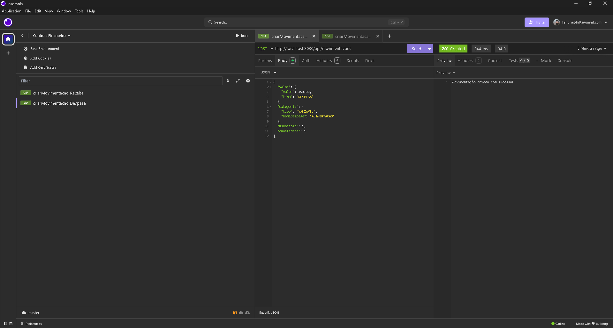
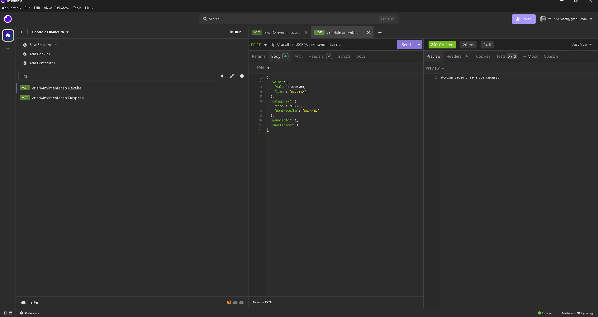
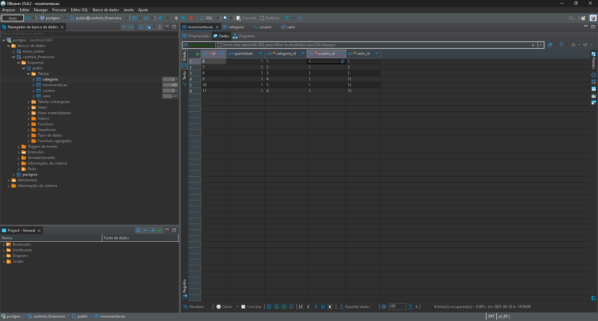
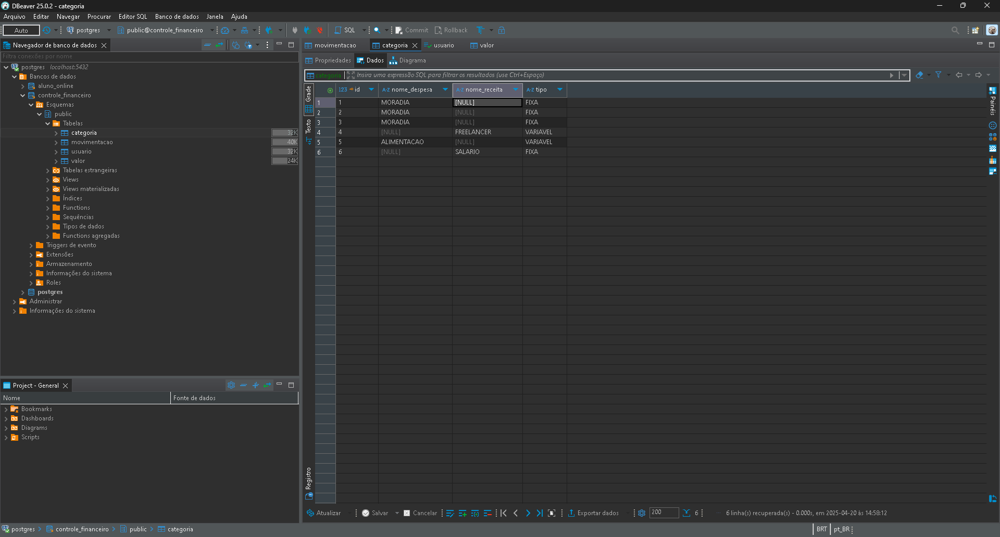
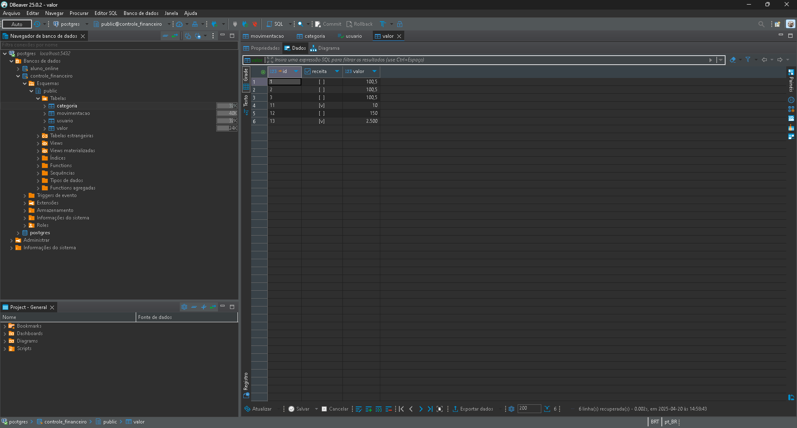

# api-controle-financeiro
 
# API de Controle Financeiro

Este projeto implementa uma API REST para gerenciamento financeiro pessoal utilizando Spring Boot.

## Tecnologias Utilizadas

- Java
- Spring Boot
- Spring Data JPA
- Maven
- Lombok
- PostgreSQL
- Insomnia
- DBeaver

## Estrutura do Projeto

O projeto segue uma arquitetura em camadas:

- **Model**: Entidades JPA que representam as tabelas do banco de dados
- **Repository**: Interfaces que estendem JpaRepository para operações de persistência
- **Service**: Classes que implementam a lógica de negócio
- **Controller**: Endpoints REST que recebem as requisições HTTP
- **DTO**: Objetos de transferência de dados entre camadas
- **Deserializer**: Classes para deserialização personalizada de dados JSON

## Como Executar

1. Clone o repositório
2. Configure o banco de dados no arquivo `application.properties` localizado em `resources`
3. Execute o comando: `mvn spring-boot:run`

## Pré-requisitos

- Java 17+
- Maven 3.6+
- PostgreSQL 12+
- Insomnia (para testes de API)
- DBeaver (para visualização do banco de dados)
## Principais Entidades

- **Movimentacao**: Registra transações financeiras
- **Categoria**: Classifica as movimentações (FIXA, VARIAVEL ou EXTRA)
- **Valor**: Armazena o valor monetário e identifica se é receita ou despesa
- **Usuario**: Proprietário das movimentações

### Categorização de Transações

**Tipos de Categoria:**
- `FIXA`: Despesas ou receitas que ocorrem regularmente
- `VARIAVEL`: Despesas ou receitas que variam em valor ou frequência
- `EXTRA`: Receitas extras ou não-recorrentes

**Categorias de Despesas:**
- LAZER, EDUCACAO, MORADIA, TRANSPORTE, ALIMENTACAO, SAUDE, PRESENTES, PET, INVESTIMENTOS, ASSINATURAS, OUTROS

**Categorias de Receitas:**
- SALARIO, BONUS, FREELANCER, VENDA, RENDIMENTO, OUTROS

## Funcionalidades

### Movimentações Financeiras

O sistema permite as seguintes operações para a entidade Movimentação:

- **Criar Movimentação**: Cadastro de novas movimentações financeiras (receitas ou despesas)

### Endpoints

#### Movimentações

- **POST** `/api/movimentacoes`: Cria uma nova movimentação financeira
  - Body:
  ```json
  {
    "valor": {
      "valor": 1500.00,
      "tipo": "RECEITA"
    },
    "categoria": {
      "tipo": "FIXA",
      "nomeReceita": "SALARIO"
    },
    "usuarioId": 1,
    "quantidade": 1
  }
  ```
  - Response: Status 201 (Created)


# Exemplos de Uso

## Testando a API com Insomnia

### Criação de Movimentação - Despesa (POST)


Nesta imagem, vemos a requisição POST para `/api/movimentacoes` com o seguinte corpo:
```json
{
  "valor": {
    "valor": 150.00,
    "tipo": "DESPESA"
  },
  "categoria": {
    "tipo": "VARIAVEL",
    "nomeDespesa": "ALIMENTACAO"
  },
  "usuarioId": 1,
  "quantidade": 1
}
```

O servidor retorna o status HTTP 201 (Created), confirmando o sucesso da operação.

### Criação de Movimentação - Receita (POST)


Nesta imagem, vemos a requisição POST para `/api/movimentacoes` com o seguinte corpo:
```json
{
  "valor": {
    "valor": 2500.00,
    "tipo": "RECEITA"
  },
  "categoria": {
    "tipo": "FIXA",
    "nomeReceita": "SALARIO"
  },
  "usuarioId": 1,
  "quantidade": 1
}
```

## Visualização no Banco de Dados (DBeaver)

### Tabela de Movimentações


Nesta captura, podemos ver a tabela `movimentacao` no banco de dados PostgreSQL contendo os registros inseridos através da API.

### Tabela de Categorias


Visualização da tabela `categoria` com os diferentes tipos de categorias para despesas e receitas.

### Tabela de Valores


A tabela `valor` armazena os valores monetários e identifica se são receitas ou despesas.

### Consulta SQL

Exemplo de consultas SQL executadas no DBeaver:

```sql
-- Consultar todas as movimentações
SELECT * FROM movimentacao;

-- Consultar total de despesas
SELECT SUM(v.valor) FROM movimentacao m
JOIN valor v ON m.valor_id = v.id
WHERE v.receita = false;

-- Consultar total de receitas
SELECT SUM(v.valor) FROM movimentacao m
JOIN valor v ON m.valor_id = v.id
WHERE v.receita = true;

-- Consultar movimentações por categoria
SELECT c.tipo, COUNT(*) FROM movimentacao m
JOIN categoria c ON m.categoria_id = c.id
GROUP BY c.tipo;
```

## Observações

- As capturas de tela demonstram o fluxo completo desde a requisição HTTP até o armazenamento no banco de dados
- As operações financeiras são corretamente categorizadas como receitas ou despesas
- As movimentações são associadas a um usuário específico do sistema
